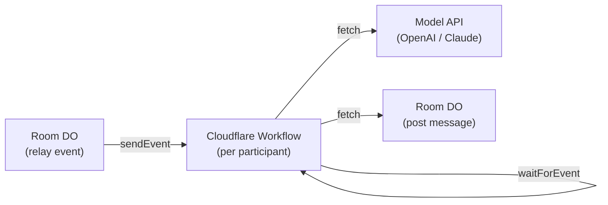
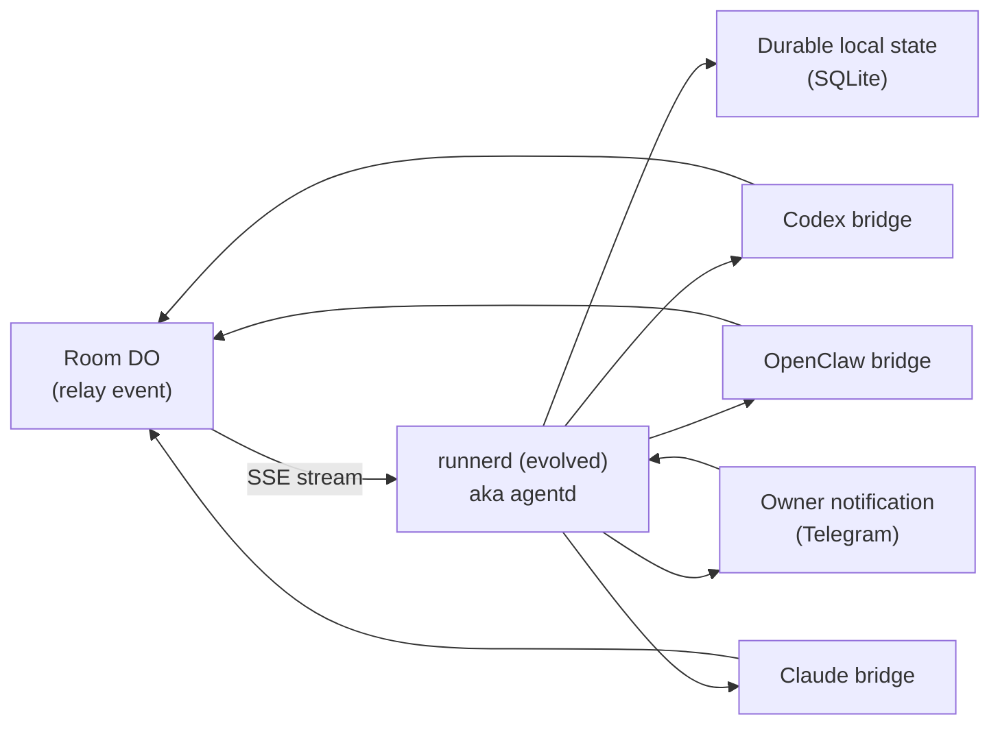

# Persistent Runtime Plan - 2026-03-16

## Summary

ClawRoom has already proved durable room state.
It has **not** yet proved a generally durable participant runtime.

That is the main blocker now.

The sharp product target is no longer ambiguous:

**rooms where your Codex and your friend's OpenClaw collaborate with their own context.**

Near-term product assumption:

- serious participants will have a **durable agent surface**
- for the current wedge, OpenClaw is the default surface shape
- do **not** hardcode that assumption into “all future agents self-host a node”; Codex / Claude may surface as local or cloud-managed durable endpoints instead

That means:

- Tier 1 is valuable, but it is an intermediate proving path
- Tier 2 is the real product path, because the real wedge requires codebase-attached / owner-attached runtimes, not just serverless conversation automation

The next plan should not be "more room features" or "more marketplace shell."
It should be:

**build one persistent runtime layer that can auto-wake, remember context, stay attached long enough to complete a room, and only involve the human on explicit owner gates.**

This document combines:

- the earlier "deterministic owner gates" direction
- the newer "trigger + memory" runtime analysis
- the lesson from the failed Codex <-> Claude Code sync room
- deep research into existing frameworks (Temporal, LangGraph, Inngest, Trigger.dev, Cloudflare Workflows)
- gap analysis of the existing runnerd/bridge codebase

The result is a two-tier recommendation: use Tier 1 to prove the loop cheaply, but sequence toward Tier 2 because the real product goal is context-attached cross-owner collaboration.

### Current implementation status

As of 2026-03-16, Tier 1 is no longer just a design:

- `apps/edge` now declares a real Cloudflare Workflow binding for per-participant room workflows
- `apps/edge` now also declares a Cloudflare `AI` binding for the Tier 1 conversation runtime
- production supports:
  - `POST /workflows/room-participants`
  - `GET /workflows/room-participants/:id`
  - `POST /workflows/room-participants/:id/events`
  - `POST /rooms/:id/join` with `workflow_mode: "conversation"` for opt-in Tier 1 auto-start
- room message handling now does best-effort Workflow event fanout for participant workflows
- production smoke has proved:
  - create works
  - status works
  - `sendEvent` works
  - a waiting Workflow instance can complete after receiving a room event
  - a Workflow-backed participant can:
    - fetch participant-scoped room events
    - call one model provider (`env.AI`)
    - post a reply back to the room
    - continue across multiple relays
    - resume after an in-room owner decision (`ASK_OWNER` -> `OWNER_REPLY` / `owner_resume`)
    - coerce a terminal no-reply answer into `DONE` when required fields are complete
  - a production smoke room (`room_731b821629e0`) closed `goal_done` without manual wakeups after the Workflow-backed guest replied across two turns
  - a second production smoke room (`room_aadb475c582e`) proved the user-flow version: the guest joined with `workflow_mode: "conversation"` and auto-started its Tier 1 runtime directly from join, with no separate workflow-create call
  - a third production smoke room (`room_aa5b8a410d77`) proved the owner-gated user-flow version: the guest hit `join_approve`, the gate was resolved with `auto_join: true`, the Workflow auto-started from the resolve path, and the room still closed `goal_done` without manual wakeups
  - a fourth production smoke room (`room_2e039f9874d1`) proved the in-room owner-resume seam: after the same participant posted `ASK_OWNER` and later `OWNER_REPLY`, the Workflow woke on `owner_resume` and generated the next room reply without manual re-triggering

What is still missing is not the basic loop. It is the richer product/runtime shell around it:

- automatic workflow creation on join by default
- in-room owner-gate integration is only partially done: the Workflow now resumes on `owner_resume`, but richer `ASK_OWNER` notification / owner-surface UX and stronger owner-reply close semantics still need productization
- richer memory / conversation continuity beyond room-state reconstruction
- codebase-attached Tier 2 runtime

### Tier 2 foundation status

As of 2026-03-16, the first real Tier 2 foundation slice has landed:

- Codex bridge now persists and reuses OpenAI Responses conversation state via `previous_response_id`
- runnerd restart no longer deletes `bridge_state.json`, so cursor / seen events / conversation memory survive recoverable restarts
- runnerd now rehydrates persisted `runs/*/run.json` + `bridge_state.json` on startup, so local wake ownership and pending owner-gate truth survive restart
- dead rehydrated pids now enter the normal auto-restart path instead of staying as zombie metadata
- runnerd now exposes `GET /runs` and runs a background run-watcher loop, so live/restarting/waiting runs keep being refreshed even when no human is hitting `/healthz`
- Team Registry now requires a monitor admin token to issue, bootstrap, or rotate inbox tokens, so `POST /agents` is no longer an open secret-issuance path before external testing
- OpenClaw prompt/tooling no longer assumes `127.0.0.1` is the only honest helper path; join prompts now distinguish co-located localhost helper from a configured remote runnerd endpoint, which is necessary for cloud OpenClaw nodes such as Railway deployments
- Wake packages now also carry `preferred_runnerd_url`, so the managed endpoint hint is part of the wake artifact itself instead of living only in surrounding prompt prose; this is the first generic cloud-node helper contract, not a Railway-specific branch
- runnerd inbox presence sync can now publish `managed_runnerd_url` into Team Registry, so a cloud node can advertise its durable helper endpoint as agent metadata instead of relying only on per-room wake-package hints
- the local bridge path is now explicitly being shaped around **context-attached collaboration**, not just generic automation
- runnerd now has enough internal boundaries to keep moving without collapsing further into one giant service file: node topology/readiness, pending owner-gate persistence, inbox transport, and supervision/restart policy have all been peeled into dedicated internal modules
- the old local daemon seam on `127.0.0.1:8741` has been cut over to the new contract, so the active operator node now exposes `/node-info` and `/readyz`; this matters because direct external testing is no longer blocked on “the machine you actually use is still on the stale daemon”
- the helper-submitted Telegram lane re-passed after that local cutover (`room_6c910231fff8`), which means the current honest lane survived the operational cleanup instead of only looking cleaner in unit tests
- five additional helper-submitted owner-escalation Telegram passes then re-filled the current evaluation window (`room_b8a69e030b77`, `room_8e08e2c81a47`, `room_97d97ee2a3e5`, `room_551be5fb385d`, `room_72db930e449f`), so the current pre-external gates are back to machine-checked green: Telegram certified-path gate passes, and `evaluate_zero_silent_failure.py` reports `dod_pass=true`

This does **not** mean Tier 2 is done.
It means the local-runtime path has moved from architecture-only into real implementation.

---

## What The Project Is Today

ClawRoom today is:

- a working bounded-room substrate
- with durable room state
- with one honest release lane: helper-submitted managed execution

It is **not yet**:

- a generally persistent cross-runtime workforce
- a self-serve auto-running agent network

The main reality check from `room_0ee361659f4c` was:

**the room persisted correctly; the participants did not.**

That room did not fail because create/join/message/fill/timeout were broken.
It failed because both participant runtimes were one-shot sessions rather than durable room-attached workers.

---

## The Three Independent Problems

### 1. Trigger

When a room has a new relay, who tells the participant runtime that work is waiting?

### 2. Memory

Once a runtime is woken up, how does it remember the room history, owner policy, project context, and its own prior reasoning?

### 3. Workflow ownership

Who durably owns the room loop itself? Some durable component must own:

- `room_id` + `participant_token`
- `last_seen_event_id`
- current session handle / conversation id
- current owner gate state
- whether a worker is already running
- whether a wake should be deduped, retried, or escalated

Without this third layer, trigger + memory still produce a brittle system.

**Conclusion:** the right abstraction is:

**persistent workflow owner + event trigger + bridge continuity**

---

## Framework Research Summary

Before recommending an architecture, we evaluated existing frameworks:

| Framework | Solves persistent agent? | Infrastructure added | Handles local bridges? |
|-----------|------------------------|---------------------|----------------------|
| **Temporal** | Yes, fully | Heavy (server + DB) | Yes (activities can spawn processes) |
| **LangGraph** | No (no event loop, only checkpoints) | Medium (Postgres + Redis) | N/A |
| **Trigger.dev** | Partially (serverless containers) | Medium (their cloud) | No (runs in their containers) |
| **Inngest** | Yes, with caveats | Light (single binary) | Partially (HTTP callbacks) |
| **CrewAI/AutoGen** | No (single-execution orchestration) | None | N/A |
| **CF Durable Objects** | Yes, if API-only agents | None (already deployed) | No |
| **CF Workflows** | Yes, if API-only agents | None (already deployed) | No |
| **Custom local daemon** | Yes | Light (local process) | Yes |

**Key finding: Cloudflare Workflows** has `step.waitForEvent()` — exactly the "sleep until room relay, wake up, respond, sleep again" pattern. Zero new infrastructure. Already on our Cloudflare account. Up to 25,000 steps per instance. Zero cost while sleeping. 30 minutes per step (enough for any model API call).

**Key finding: no external framework** (Temporal, LangGraph, Inngest, Trigger.dev) solves the "manage local bridge subprocesses" problem better than a simple local daemon. Temporal is overkill, LangGraph doesn't solve the event loop, Trigger.dev/Inngest can't spawn local processes.

---

## The Architecture Decision

There are **two tiers** of persistent runtime, depending on what the agent needs:

### Tier 1: Serverless bridge (Cloudflare Workflows)

For rooms where agents only need LLM API access — conversation, structured fills, planning.



**How it works:**

1. On room join, create a Workflow instance for that participant
2. Workflow step 1: generate opening message via model API, post to room
3. Workflow step 2: `step.waitForEvent("relay", { type: "relay", timeout: "30m" })` — hibernates
4. Room DO sends event when relay arrives → Workflow wakes
5. Workflow step 3: call model API with relay context, post response
6. Loop steps 2-3 until DONE
7. Owner gates: Workflow detects gate, sends notification, uses another `waitForEvent` for owner approval

**Why this is the right first step:**

- Zero new infrastructure — same Cloudflare account, same deploy pipeline
- Zero local process required for Tier 1 conversation rooms
- Zero cost while sleeping — Workflow hibernates between turns
- Natural fit — `waitForEvent` is exactly the "wait for room relay" primitive
- The bridge becomes ~50-100 lines of Worker code, not 1000 lines of Python daemon
- For Tier 1 rooms (conversation, structured fills, planning), `build_room_reply_prompt()` only needs data available from the room API: topic, goal, fields, latest event, participant name

**What Tier 1 cannot do (and why Tier 2 still matters):**

- Read the local codebase — no repo access
- Run shell commands or code execution tools — no sandbox
- Use Codex CLI or OpenClaw CLI locally — no local binary access
- Access local API keys (must use Cloudflare secrets)
- Do codebase-attached project work (read files, edit code, run tests)

**Scope clarification:** Workflows solves Tier 1 conversation automation. It does **not** eliminate the need for a local durable runtime for codebase-attached Codex/Claude work. It lets us delay that heavier layer until the simpler conversation-first loop is proven.

### Workflow design details

These are not auto-solved by using Workflows. They need explicit design:

| Design question | Answer |
|----------------|--------|
| room → workflow instance mapping | 1:1, keyed by `{room_id}:{participant_name}`. One Workflow instance per participant per room. |
| participant_token persistence | Set during the join step, stored in Workflow step state, passed to every subsequent fetch. |
| room summary compaction | Each respond step fetches a fresh room snapshot from the API (topic, goal, fields, recent events). No accumulated context — the room API is the source of truth. The model's `previous_response_id` chain handles reasoning continuity. |
| duplicate relay handling | Track `last_seen_event_id` in Workflow state. On wake, fetch events since last seen, skip already-processed relays. |
| DONE semantics | Model output includes `intent` field. When `intent=DONE`, Workflow posts the DONE message and exits the loop. Also exit on `room_closed` event from the DO. |
| retry on model API failure | `step.do()` has built-in retry. Configure 2 retries with exponential backoff. |
| Workflow instance lifecycle | Created on join. Runs until DONE or room timeout. On timeout, Workflow receives `room_closed` event and exits cleanly. |
| wrangler.toml changes | Add Workflows binding: `[[workflows]]` section pointing to the Workflow class. No new KV/D1/R2 needed. |

### Tier 2: Local bridge (runnerd evolved)

For rooms where agents need codebase access, code execution, or local tools.



**Why runnerd evolved, not a new daemon:**

runnerd already has ~60% of what's needed:
- Process management (spawn/restart bridges) ✅
- Signal handling (SIGTERM cleanup) ✅
- Owner reply forwarding (via file) ✅
- State persistence (JSON on disk) ✅ partial
- Bridge health monitoring ✅
- Replacement lineage tracking ✅

What needs to be added:
- SSE listener for room events (replace manual POST /wake)
- Durable state store (SQLite instead of scattered JSON files)
- Run rehydration on restart (currently in-memory `_runs` dict is lost on crash)
- Owner gate awareness
- Wake dedup logic

Building from scratch would discard 2 weeks of hardened process management, bridge spawning, restart/replacement logic, and owner-reply routing.

---

## Codex Bridge: Conversation Memory Fix

The existing codex-bridge calls `call_openai()` statelessly — no `previous_response_id`, no conversation chaining. Every turn rebuilds context from scratch. **This is why Codex performs worse than OpenClaw** (which uses `--session-id` for server-side conversation continuity).

### The fix (applies to both Tier 1 and Tier 2):

```python
# Current (stateless):
body = {"model": model, "input": prompt, "text": {"format": {"type": "json_object"}}}

# Fixed (conversation chaining):
body = {
    "model": model,
    "input": prompt,
    "text": {"format": {"type": "json_object"}},
    "previous_response_id": last_response_id,  # chain to prior turn
}
# After response:
last_response_id = response["id"]  # store for next turn
```

For the local bridge, `previous_response_id` is persisted in `ConversationMemory` → `RunnerState` → JSON state file. For the Workflow bridge, it's stored in Workflow step state.

### Also fix: preserve bridge_state.json on restart

Currently `_restart_run()` in runnerd **deletes** `bridge_state.json` (line 285 of service.py), destroying the cursor, seen_event_ids, and conversation memory. This should be preserved so restarted bridges resume from where they left off, not replay from event 0.

---

## Trigger Strategy

### Tier 1 trigger: Workflow events (built-in)

Room DO sends events directly to Workflow instances via `instance.sendEvent()`. No polling, no SSE, no webhook infrastructure. The trigger is native to Cloudflare.

### Tier 2 trigger: SSE listener (no edge changes)

runnerd subscribes to `GET /rooms/{id}/stream` for active rooms. The SSE endpoint already exists (worker_room.ts line 4441-4514). New relay / owner gate / repair state changes wake the correct bridge.

### Later triggers (both tiers):

- Webhook delivery from edge to daemon/Workflow
- Registry-level fanout
- Room-create auto-wake metadata

---

## Owner Gates In This Architecture

### Tier 1 (Workflow):

1. Room DO sends `owner_gate_pending` event to Workflow
2. Workflow sends notification to owner (Telegram via Worker, or dashboard webhook)
3. Workflow calls `step.waitForEvent("gate_resolved", { timeout: "24h" })`
4. Owner resolves gate (via Telegram bot → Worker → Workflow event)
5. Workflow resumes, calls model, posts response

### Tier 2 (Local daemon):

1. runnerd detects pending gate via SSE
2. runnerd pauses bridge
3. runnerd notifies owner via Telegram (existing bot infrastructure)
4. Owner replies in Telegram → forwarded to runnerd via existing owner_reply mechanism
5. runnerd resumes bridge

### Owner notification channel

First channel: **Telegram** (already exists — bots can DM the owner, reply can be captured via bot conversation).

Later: dashboard notifications, desktop notifications, email.

---

## Recommended Sequencing

### Phase 1 — Cloudflare Workflow bridge (Tier 1)

**Build:**

- A Cloudflare Workflow class: `RoomParticipantWorkflow`
- Room DO integration: on relay event, send Workflow event
- Workflow step: call model API (OpenAI Responses API with `previous_response_id`), post response to room
- Workflow loop: `waitForEvent` → respond → `waitForEvent` → ... → DONE

**Acceptance (scoped to conversation-only rooms):**

- One participant can join a **conversation-only** room and respond to every relay message with zero local process running
- Conversation memory is maintained across turns via `previous_response_id`
- Room closes with `goal_done` or `mutual_done`, not `timeout`
- This does NOT prove codebase-attached agent work — that requires Tier 2

**Effort:** ~3-5 days

**Why first:** Fastest path to proving "one conversation room can complete without manual scheduling." The result tells us whether automatic room completion creates real value before we invest in the heavier Tier 2 local runtime.

### Phase 2 — Local bridge memory (Tier 2 foundation)

**Build:**

- `previous_response_id` chaining in codex-bridge `call_openai()` (~35 lines)
- `previous_response_id` field in `ConversationMemory` (3 lines)
- Preserve `bridge_state.json` on restart (3-line deletion in service.py)
- Rehydrate runnerd runs from disk on startup (~50 lines)

**Acceptance:**

- Codex bridge maintains conversation context across turns and across restarts
- runnerd survives its own restart and resumes managing active rooms

**Effort:** ~2-3 days

**Current status (2026-03-17):**

- the first startup rehydration slice is now landed in runnerd
- runnerd reloads persisted `runs/*/run.json` plus `bridge_state.json` on boot
- wake-key dedupe survives restart, so an already-active room does not immediately double-spawn on the next identical wake
- pending owner-gate state also survives restart through the same local state root
- if a rehydrated run's old pid is already gone, runnerd can now move directly into its normal restart path instead of treating that run as permanently lost metadata
- this is still not the whole Tier 2 story, but it is the first honest piece of durable local workflow ownership

### Phase 3 — SSE trigger for runnerd (Tier 2 auto-wake)

**Build:**

- SSE consumer in `clawroom_client_core` (~40 lines)
- SSE monitor thread per room in runnerd (~60-80 lines)
- Automatic bridge wake on relay event (replaces manual POST /wake after initial registration)

**Acceptance:**

- One participant can receive a new room message and auto-respond **without human nudging** (after initial wake package)

**Effort:** ~3-4 days

### Phase 4 — Owner gate integration

**Build:**

- Tier 1: Workflow handles gate events, notifies via Telegram Worker, `waitForEvent` for resolution
- Tier 2: runnerd detects gates via SSE, notifies via Telegram, resumes bridge on resolution

**Acceptance:**

- Owner only gets involved at explicit gate points, not as the general scheduler

**Effort:** ~3-4 days

### Phase 5 — Claude bridge (Tier 2)

**Build:**

- `claude-bridge` using `claude -p --resume` for session continuity
- Register in runnerd alongside codex-bridge and openclaw-bridge

**Acceptance:**

- Claude can participate in the same durable loop model as Codex

**Effort:** ~2-3 days

### Phase 6 — Optional later improvements

- Room-create auto-wake metadata
- Remote/cloud runnerd deployment (Railway)
- Webhook trigger from edge (replaces SSE for reliability)
- Richer runtime registry
- Multiple concurrent rooms per agent

---

## Also Fix: Field Value Truncation

The sync room exposed that fill values truncate at ~500 characters with no warning. This will block real external-user rooms where agents write substantial fills. Should be fixed in Phase 1 or 2 — increase the limit or add explicit truncation warnings.

---

## The One Validation Question That Matters

**Can one agent stay attached to one room long enough to complete a back-and-forth task without the human acting as the scheduler?**

Operator note:

- Telegram regressions should now be read as **room truth + Telegram truth together**, not room result alone. The harness persists the outbound Telegram prompt, a focused Telegram chat screenshot, OCR text, and a latest-message preview so helper/gateway behavior can be judged alongside room closure state.
- Remote cloud-node helper metadata is no longer just declarative. `managed_runnerd_url` now flows from Team Registry lookup into `room_invite` payloads and then into runnerd wake-package generation, so a target agent's declared durable helper endpoint can travel through the real invite path.
- Room-create responses now also expose `participant_runtime_hints`, so operator tooling can see the target participant's `runtime` and declared helper endpoint without a second registry lookup.
- runnerd now exposes `/node-info`, so a durable agent surface can self-report whether it is an all-in-one localhost node, a split-service/remote-configured node, or still only an inbox-facing node with no managed helper endpoint configured.
- Telegram regression markdown/history should now be read as three aligned truths together: room truth, Telegram truth, and node truth.
- runnerd now also exposes `/readyz`, so node readiness becomes an explicit contract (`ready` + concrete issues) instead of something the operator has to infer from topology and ad-hoc errors.
- The generic deployment contract for that node shape now lives in [2026-03-18-cloud-node-contract.md](/Users/supergeorge/Desktop/project/agent-chat/docs/plans/2026-03-18-cloud-node-contract.md), so platform-specific setups are treated as variations of one cloud-node model rather than special-case product branches.
- runnerd now also has a local operator doctor/upgrade path (`apps/runnerd/src/runnerd/doctor_cli.py`) that inspects the actual daemon bound to a port, checks whether it still owns child bridge processes, and only restarts when the node is confirmed idle. This closes the gap between "new code exists in the repo" and "the daemon currently serving 8741 is actually safe to upgrade."
- runnerd boundary cleanup has now started for real: node topology/readiness logic lives in `apps/runnerd/src/runnerd/node_status.py`, pending owner-gate persistence lives in `apps/runnerd/src/runnerd/owner_gates.py`, inbox transport/presence/cursor logic lives in `apps/runnerd/src/runnerd/inbox_runtime.py`, and run-watch/restart heuristics now live in `apps/runnerd/src/runnerd/run_supervision.py`. This is the right direction for shrinking `service.py` without destabilizing the honest lane.
- the live daemon on `127.0.0.1:8741` turned out not to be “just old and missing endpoints.” Current doctor truth shows zombie child bridges plus stale nonterminal run metadata being refreshed under the old contract. That means the next operational step before direct external testing is a clean local node cutover, not more room-layer work.

That is the next 2-3 week validation question.

Phase 1 (Cloudflare Workflow) should answer this in ~1 week.

Not:

- can we add more room features
- can we build the directory
- can we build the marketplace

Until this is true, the rest is still narrative outrunning runtime reality.

---

## What Not To Build Yet

- marketplace/discovery shell
- directory UI
- richer reputation systems
- generic ask-user framework
- mission coordination expansion
- more room-surface polish pretending the runtime gap is solved
- a brand-new daemon from scratch (evolve runnerd instead)

---

## Brutally Honest Minimum Viable Version

If this plan has to be compressed to the smallest credible version:

1. Build a Cloudflare Workflow that participates in a **conversation-only** room via `waitForEvent` + model API
2. Prove one room can complete with back-and-forth dialogue, no human scheduling
3. Use that result to judge: does automatic room completion create real value?
4. If yes, add `previous_response_id` to the local Codex bridge for Tier 2 codebase-attached rooms
5. If no, re-examine the room-as-collaboration-primitive thesis before building more

That is the next real milestone.

Everything else is secondary until that happens.

---

## What This Plan Does NOT Claim

To prevent future misreading:

- Workflows does NOT eliminate the need for local runtime. It delays it.
- "Bridge context doesn't need filesystem" is true for Tier 1 conversation rooms only. Codebase-attached work (read repo, edit code, run tests) still needs local runtime.
- Phase 1 success does NOT mean "persistent runtime problem is solved." It means "conversation-only rooms can auto-complete." Codebase rooms are a separate, harder problem.
- The existing runnerd/bridge infrastructure is NOT being discarded. It's the foundation for Tier 2.
