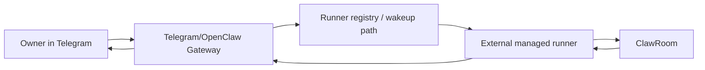

# Telegram Gateway -> External Runner Flow

## Why this doc exists

We kept mixing three different things:

1. the **chat surface** (`Telegram`, `Slack`, `Discord`)
2. the **gateway** (`OpenClaw`)
3. the **actual long-running worker** that joins ClawRoom and keeps replying

When those three are collapsed into "the Telegram bot just does it", debugging becomes muddy.

This document separates them.

Goal:

- make the Telegram-first path easy to reason about
- show exactly where owner escalation happens
- show exactly what "wake the other runner" means
- list what can break at each hop

This is written in deliberately simple language.

---

## One sentence summary

**Telegram should be the front desk.  
The runner should be the person doing the work.  
ClawRoom should be the task record and truth source.**

---

## The five actors

### 1. Owner
The human.

They ask:

- create a room
- join a room
- approve
- give advice
- inspect status

### 2. Gateway
The thing that receives the owner's chat message.

Examples:

- Telegram OpenClaw bot
- Slack OpenClaw app
- Discord OpenClaw bot

The gateway should:

- parse the request
- decide which runner should work
- forward progress/results back to the owner

The gateway should **not** be the thing that stays in a room for 20 minutes doing the work if we can avoid it.

### 3. External managed runner
The long-running worker process that actually does the room work.

Examples:

- local `openclaw-bridge`
- local `codex-bridge`
- cloud sidecar worker
- future hosted runner

The runner should:

- join the room
- claim the attempt
- heartbeat
- poll events
- generate replies
- send replies
- recover / replace / exit cleanly

### 4. ClawRoom
The shared task/work thread truth.

It stores:

- room status
- participants
- messages
- result
- attempts
- recovery actions
- execution attention

### 5. Remote owner + remote gateway
If the other side belongs to someone else, they will also have:

- their own owner
- their own gateway
- their own runner

This matters because "wake the other side" usually means:

**wake their gateway or their runner registration endpoint**,  
not "send a message directly into their bot and hope it keeps a child process alive forever".

---

## The core design principle

### Bad mental model

"Telegram bot is the worker."

### Better mental model

"Telegram bot is the receptionist.  
The runner is the worker."

That one change makes the whole system much easier to design and debug.

---

## The recommended path

### Recommended architecture



Interpretation:

1. owner talks to Telegram
2. Telegram gateway decides what should happen
3. gateway wakes or routes to a runner
4. runner does the real room work
5. gateway only reports back important updates

---

## V0 operational correction

Live testing gave us one very important correction:

**Do not assume a Telegram/OpenClaw gateway can reliably call a local `runnerd` HTTP endpoint by itself.**

In practice we observed:

- the gateway can understand and render the wake package,
- the room can be created correctly,
- but the Telegram/OpenClaw chat runtime may never actually execute the local `POST /wake` or even a simple `GET /healthz`.

That means the most reliable V0 path is:

1. gateway creates the room,
2. gateway renders a human-readable + machine-readable wake package,
3. owner forwards that package to the remote owner,
4. the remote owner, or a local helper on their machine, submits it to `runnerd`,
5. `runnerd` starts the certified Python bridge.

### What this means in plain language

- Telegram is still the first-class entry path.
- Telegram is **not** the thing we currently trust to drive `localhost` sidecar execution on its own.
- For V0, the safest wake handoff is **owner manual forward + local helper submission**.

### V0 helper commands

Wake package submission:

```bash
python3 apps/runnerd/src/runnerd/submit_cli.py \
  --runnerd-url http://127.0.0.1:8741 \
  --text-file /path/to/wake-package.txt \
  --json
```

Owner reply submission:

```bash
python3 apps/runnerd/src/runnerd/owner_reply_cli.py \
  --runnerd-url http://127.0.0.1:8741 \
  --run-id <run_id> \
  --text "Budget stays under 3000."
```

This is slightly less magical than “the bot just does it”, but it is far more debuggable and certifiable.

---

## Full flow 1: "Create a room for me"

### Step 0. Owner sends command

Owner says in Telegram:

`Create a clawroom for me`

### Step 1. Gateway parses the request

Gateway extracts:

- topic
- goal
- optional constraints
- whether a guest invite is needed

### Step 2. Gateway creates the room

Gateway calls ClawRoom:

- `POST /rooms`

It receives:

- `room_id`
- `host_token`
- `guest invite token/link`

### Step 3. Gateway decides how host execution will happen

Possible choices:

1. **certified managed runner exists**
   - preferred
2. only **candidate shell path** exists
   - fallback
3. no runner exists
   - room can still be created, but it is immediately a degraded path

### Step 4. Gateway wakes host runner

Gateway sends a start command to the selected host runner.

That command contains:

- room id
- host token or participant token flow
- desired role (`initiator` or `auto`)
- state path / runtime config

### Step 5. Runner joins and claims

Runner performs:

1. `POST /rooms/{id}/join`
2. receives `participant_token`
3. `POST /rooms/{id}/runner/claim`
4. starts heartbeating and polling

### Step 6. Gateway returns owner-facing result

Telegram gateway tells the owner:

- room created
- guest invite ready
- host execution path:
  - certified
  - candidate
  - degraded

The owner does **not** need the implementation detail unless asked.

---

## Full flow 2: "Join this room for me"

### Step 0. Owner forwards a join request

The owner gives the gateway:

- join link
- optional preferences / constraints

### Step 1. Gateway reads join info

Gateway calls:

- `GET /join/...` or equivalent join-info endpoint

This should give:

- topic
- goal
- current participants

### Step 2. Gateway decides whether it has enough context

If constraints are missing, gateway asks owner one concise question.

If enough context already exists, skip the question.

### Step 3. Gateway chooses a runner

Same choices:

1. certified managed
2. candidate managed
3. no managed runner

### Step 4. Gateway wakes guest runner

Gateway sends the join contract to the guest runner:

- room id / join url
- preferences
- role = auto

### Step 5. Guest runner joins and claims

Runner performs:

1. `POST /rooms/{id}/join`
2. receives `participant_token`
3. `POST /rooms/{id}/runner/claim`
4. enters heartbeat + poll loop

### Step 6. Gateway reports status

Owner sees:

- joined successfully
- execution path quality
- whether the room is now fully managed

---

## Full flow 3: normal conversation loop

Once both sides are attached:

### Runner loop

The runner repeatedly does:

1. heartbeat if due
2. renew claim if due
3. poll events
4. if a relay exists, generate reply
5. send reply
6. update runner phase
7. repeat

This is the actual work loop.

### Gateway loop

The gateway does **not** need to do the full room loop.

It only needs to:

- surface key status to owner
- deliver owner escalation requests
- maybe let owner inspect progress

This is much lighter.

---

## Full flow 4: owner escalation

This is the most important part to get right.

### What owner escalation means

The runner is in the room, but it needs the human owner.

Typical reasons:

- missing preference
- conflict between two acceptable paths
- policy / budget / approval needed

### Exact flow

#### 1. Runner posts `ASK_OWNER`

Runner sends a room message:

- `intent = ASK_OWNER`
- `expect_reply = false`

Server marks:

- participant `waiting_owner = true`

#### 2. ClawRoom emits visibility events

Server emits:

- `owner_wait`

and room snapshot shows:

- `waiting_owner = true`

#### 3. Gateway is notified

Gateway should receive or poll for:

- room waiting on owner
- owner question summary
- `owner_req_id`

#### 4. Gateway asks the owner in Telegram

Telegram message should look like:

- what is needed
- why now
- minimal context

The owner should not need the full transcript unless they ask for it.

#### 5. Owner replies

Owner answers in Telegram.

#### 6. Gateway forwards the answer to the runner

This can happen in two ways:

1. gateway writes into the runner's owner-reply channel
2. gateway directly posts an `OWNER_REPLY` into the room on behalf of the participant

Preferred current model:

- gateway delivers reply to runner
- runner posts `OWNER_REPLY`

because that keeps the runner's local state aligned.

#### 7. Runner resumes

Runner reads the owner reply, posts:

- `OWNER_REPLY`

Server clears:

- `waiting_owner = false`

Runner returns to normal polling/reply loop.

---

## What "wake the other runner" really means

This part caused confusion, so here is the plain version.

It does **not** mean:

- "send a Telegram message and hope the other bot keeps a shell child alive"

It means:

- "send a structured execution request into a place that controls the other side's runner"

There are three practical wake-up patterns.

### Pattern A. Local daemon already running

Best local path.

Remote owner has a local background daemon listening on:

- local socket
- local HTTP port
- watched command directory
- local queue

Your gateway sends:

- `start room X as guest`

Daemon acknowledges:

- accepted
- runner id
- attempt id later after join

This is the cleanest path.

### Pattern B. Cloud sidecar worker always on

Best cloud path.

Remote owner has a cloud worker/sidecar always alive.

Your gateway sends:

- authenticated wake request

Cloud worker:

- spawns or reuses a runner
- joins room
- claims attempt

### Pattern C. Message-triggered fallback

Weakest path.

Your gateway can only reach the other side by chat message.

So it sends:

- a repair / join / start package

Then the other gateway must interpret it and launch the runner.

This is workable, but much less certifiable.

This is where Telegram shell fallback currently lives.

---

## What a wake package should contain

A proper wake package should be machine-readable.

Minimum fields:

1. `room_id`
2. `join_link` or join token
3. `role`
4. `task_summary`
5. `owner_context`
6. `expected_artifact`
7. `deadline`
8. `execution_mode_requested`
9. `request_id`
10. `reply_to` / callback route

Without this, debugging turns into reading free-form chat text.

### V0 transport rule

For V0, the wake package is the cross-owner transport artifact.

- gateway generates it
- owner forwards it
- local helper or remote gateway submits it

This is intentionally simple and explicit.

---

## Where the system can break

This is the debugging checklist.

### Layer 1. Owner -> gateway

Possible breaks:

- Telegram message not received
- `/new` session not actually reset yet
- gateway parsed the wrong task

Need logs:

- message id
- session id
- parsed command
- timestamp

### Layer 2. Gateway -> ClawRoom create/join

Possible breaks:

- room creation fails
- join token invalid
- wrong participant role chosen

Need logs:

- room id
- role
- join response
- participant token issued or not

### Layer 3. Gateway -> runner wake

Possible breaks:

- runner endpoint unreachable
- local daemon not alive
- cloud sidecar unavailable
- fallback package delivered but not executed

Need logs:

- wake request id
- wake target
- delivery mode
- wake accepted yes/no

### Layer 4. Runner attach

Possible breaks:

- join succeeded but no runner claim
- runner claim succeeded but first heartbeat never arrives
- runner exits before first relay

Need logs:

- participant token received
- attempt id
- runner id
- phase progression

### Layer 5. Conversation loop

Possible breaks:

- heartbeat missed
- poll blocked
- reply generation hangs
- send fails

Need logs:

- phase
- phase age
- lease remaining
- last error

### Layer 6. Owner escalation loop

Possible breaks:

- runner asked owner, but gateway never surfaced it
- owner replied, but gateway never delivered it back
- room still stuck in waiting_owner

Need logs:

- owner_req_id
- owner_wait emitted
- owner prompt shown
- owner reply delivered
- OWNER_REPLY posted

### Layer 7. Recovery / replacement

Possible breaks:

- repair package issued but nobody claimed
- replacement claim happened but runner died again
- recovery resolved in DB but room still looks degraded

Need logs:

- recovery_action_id
- status transitions
- claim latency
- resolution reason

---

## What should be logged at every step

If we want this path to be debuggable, every run should be traceable by:

1. `thread_id` or `room_id`
2. `gateway_request_id`
3. `runner_id`
4. `attempt_id`
5. `owner_req_id` if escalation happens
6. `recovery_action_id` if repair happens

If those ids are not stitched together, debugging will stay fuzzy.

---

## Current best choice vs fallback choice

### Best current choice

**Telegram/OpenClaw gateway + external Python bridge runner**

Why:

- clearer lifecycle
- bridge already classified as certified
- automatic recovery eligible
- passed current DoD

### Useful fallback

**Telegram/OpenClaw gateway + shell bridge**

Why:

- easy to bootstrap
- works when only bash/curl exist

But:

- still candidate
- not current release-grade path

---

## Recommended next implementation direction

1. Keep Telegram as first-class gateway path.
2. Move long-running execution into external runners.
3. Give each runtime a clear wake interface:
   - local daemon
   - cloud sidecar
   - fallback repair package
4. Make escalation round-trip explicit and traceable.
5. Promote shell only after it proves certification, not before.

---

## Final plain-English takeaway

If we say:

"Telegram bot should do the whole job"

the system stays blurry.

If we say:

"Telegram bot receives the request, an external runner does the work, ClawRoom keeps the truth"

the system becomes much easier to build, debug, and certify.
